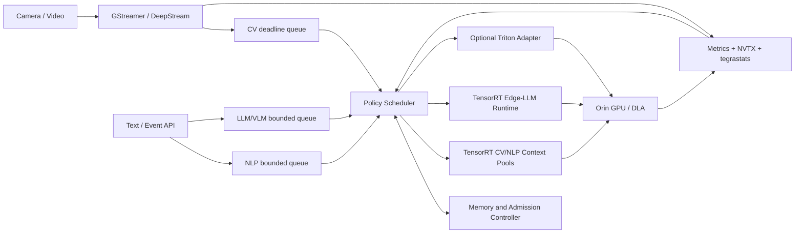
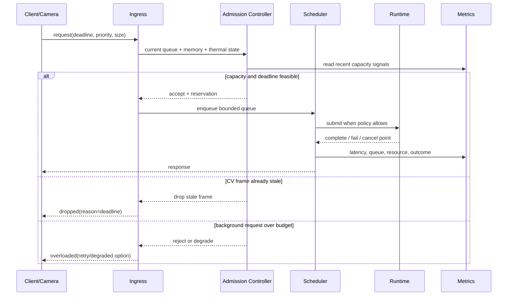

# 多模型并发架构

## 目标

在 Jetson Orin NX 16GB 上同时承载：

- **实时 CV**：摄像头检测/分割，硬 SLA，不能被后台模型无限拖慢；
- **突发 NLP/Embedding**：请求短、到达不均匀，有 p95 latency 目标；
- **后台 LLM/VLM**：占用 weights/KV cache 大，生成时间长，可限流、降级或取消。

目标不是让三个模型“同时启动”，而是在明确资源预算下最大化满足 SLA 的 **goodput**，并让过载行为可预测。

## 四种并发

| 类型 | 含义 | 示例 | 主要风险 |
| --- | --- | --- | --- |
| 请求并发 | 同一模型有多个请求 | 多个 embedding 请求 | queue、batch delay、context 数量 |
| 模型并发 | 多个不同模型执行 | detector + embedder | SM/DRAM/CPU 争用 |
| pipeline 并发 | 不同阶段重叠 | decode N+1 与 infer N | buffer 生命周期、隐式同步 |
| 异构并发 | CPU/GPU/DLA/video 同时工作 | decode + GPU CV + CPU tokenize | 内存带宽、I/O、跨设备转换 |

“并发数 4”没有完整含义，必须说明哪一种并发、请求形状、batch、模型实例和到达模式。

## 参考架构



关键点：

- 每类 workload 有独立有界队列；
- scheduler 只做跨模型策略，不重写 TensorRT/Edge-LLM；
- memory/admission controller 在接受任务前检查预算；
- runtime adapter 隔离不同框架；
- telemetry 不只是 dashboard，还驱动过载决策；
- CV deadline 高于后台 LLM 吞吐。

## 核心组件

### 1. Ingress 与请求契约

每个请求至少带：

```text
request_id
model_id + model_version
arrival_time
deadline or timeout
priority_class
input_shape / token estimate
cancel handle
trace context
```

没有 deadline 和取消语义，就无法区分“仍有价值的请求”和“完成了也已经超时的工作”。

### 2. 独立有界队列

不要用一个全局 FIFO：长 LLM 请求会阻塞短 CV/NLP 请求。建议：

- CV：小容量、按 deadline 排序，过期帧直接丢弃或使用 latest-frame 策略；
- NLP：有界 FIFO/priority queue，可在短窗口形成 batch；
- LLM/VLM：严格并发和 token/KV 预算，排队超时可拒绝；
- maintenance：最低优先级，用于 warm-up/健康检查。

队列容量不是越大越好。大队列会把过载隐藏成高 tail latency。

### 3. Policy Scheduler

首版策略保持简单、可解释：

1. CV deadline 即将到达时，不启动新的低优先级大任务；
2. NLP 只在等待窗口和 p95 budget 允许时 batching；
3. LLM/VLM 按可用 KV/内存和 token budget 准入；
4. 过载时拒绝/取消后台请求，而不是让所有 workload 一起退化；
5. 每次决策记录原因和当时资源快照。

不要第一版就实现复杂在线学习调度器。固定规则更容易建立因果证据。

### 4. Model/Context Pool

TensorRT 通常按 engine 管理有限 execution contexts：

```text
model runtime
  engine (immutable after load)
  optimization profiles
  context pool [context + stream + buffers]
  input/output buffer pools
  warm state
```

pool 上限同时受 latency 收益和内存预算约束。多 context 不一定提高吞吐，可能只增加 activation memory 和争用。

Edge-LLM 的请求/KV cache 管理由其 runtime 能力承载，项目 scheduler 负责外围 admission、优先级与跨模型资源边界，不复制内部 decoder 调度。

### 5. Memory Budget Manager

Orin 16GB 统一内存预算应显式分项：

```text
system reserve
+ video/camera buffers
+ TensorRT engine weights
+ TensorRT context activations/workspaces
+ preprocess/postprocess pools
+ Edge-LLM weights
+ KV/context cache
+ runtime/server/container overhead
+ safety headroom
<= measured safe working set
```

不能用理论 16GB 全部做模型预算。Linux、桌面、page cache、驱动和其他进程都需要空间。预算值应来自热稳态峰值而非启动时 free memory。

### 6. Runtime Adapters

统一小接口即可：

```text
load(manifest)
warmup(profile)
estimate(request)
submit(request, deadline, cancel_token)
health()
metrics()
drain_and_unload()
```

各 adapter 处理：

- TensorRT C++：engine/context/stream/buffer；
- DeepStream：pipeline/source/buffer/probe；
- Edge-LLM：model/KV/generation request；
- Triton：client/model readiness/metrics。

不要为了统一接口强行把 stateful LLM 当作普通 batch=1 TensorRT 请求。

## 调度策略

### Priority 不等于 GPU 抢占

软件 priority 能决定“下一个提交什么”，但已经运行的长 CUDA kernel 未必可即时抢占。保障 CV 的方法包括：

- 不在 deadline 临界点启动大后台工作；
- 控制 LLM 并发和 batch；
- 使用较细粒度/可迭代 runtime 的调度点；
- 分析 kernel duration，避免特别长的独占 kernel；
- 对支持的 CV workload 评估 DLA；
- 为 CV 保留 context、buffer 和队列容量。

### Deadlines

CV 使用绝对 deadline：

```text
deadline = capture_timestamp + frame_budget
```

进入 inference 前若剩余 budget 小于估计执行时间，可以丢弃旧帧而处理新帧，避免积压。

NLP/LLM 使用 request timeout 与生成 token 上限。超时后应停止继续消耗无价值资源；若 runtime 不能即时取消，至少停止后续迭代并丢弃响应。

### Backpressure

背压不是返回一个错误这么简单，它应在不同入口传播：

- camera：drop oldest/latest only、降低采样帧率；
- NLP API：`429/RESOURCE_EXHAUSTED`、重试提示；
- LLM：限制并发、token、context，排队超时拒绝；
- upstream：发送当前健康/容量等级。

### Admission Control

`admission control` 在接收请求前检查：

- queue 是否有容量；
- deadline 是否可能满足；
- 估计 activation/KV cache 是否越界；
- 当前温度/功耗是否进入降级区；
- runtime 是否 ready；
- 该 tenant/model 是否超过配额。

无法满足时尽早拒绝，比最终 OOM 或超时更可控。

### 降级顺序

建议预先定义，不在事故时临时决定：

1. 停止非必要 warm-up/后台任务；
2. 限制新 LLM/VLM 并发和 max tokens；
3. 降低 VLM 图像频率/分辨率；
4. 降低 NLP batch 等待或直接拒绝低优先级请求；
5. 降低 CV 非关键分支频率，但保留主检测 SLA；
6. 进入保护模式并暴露 degraded health。

具体顺序由业务决定，重点是可配置、可测试和可观察。

## Batching 不能一套参数通吃

### CV

实时单路 CV 常以 batch=1 最小化延迟；多路视频可以按相近 deadline/mux batch 组织，但 batch 等待不能超过帧 budget。

### NLP/Embedding

通常适合 dynamic batching：按 sequence length bucket，短暂等待换吞吐。必须扫描 batch size 和 queue delay 对 p95 的影响。

### LLM/VLM

prefill 和 decode 特征不同。continuous/inflight batching 在每个迭代调度新旧请求；KV cache 容量和不同序列长度是核心约束。不能用无状态 CV dynamic batcher 的直觉代替 LLM runtime 自身调度。

### Triton 的作用

Triton 支持 per-model dynamic batcher、sequence batcher、instance group、priority/queue policy 和 metrics。它适合验证成熟机制，但跨 CV 硬 SLA 和独立 Edge-LLM runtime 的全局策略仍可能需要项目自己的 supervisor/admission 层。

## 过载处理序列



## 指标体系

### CV

- source/capture FPS；
- processed FPS；
- end-to-end p50/p95/p99；
- queue wait；
- dropped/stale frame rate；
- preprocess/infer/postprocess 分解；
- task quality（mAP/IoU/业务指标）。

### NLP/Embedding

- requests/s 与 items/s；
- p50/p95/p99；
- queue/batch wait；
- actual batch size 分布；
- sequence length 分布；
- accuracy/recall/业务质量。

### LLM/VLM

- TTFT（time to first token）；
- TPOT（time per output token）；
- input/output tokens/s；
- end-to-end latency；
- active/queued requests；
- KV cache 使用/拒绝；
- prefix/context reuse 命中率（若启用）；
- 输出质量或任务评分。

### 系统

- CPU per-core、GPU/EMC 频率和利用趋势；
- unified memory current/peak；
- power、temperature、throttling；
- engine/context/KV/buffer 分项内存；
- queue depth、reject/cancel/error；
- container/process RSS/PSS；
- restart/recovery time。

### Goodput

吞吐只统计完成数量；goodput 只统计**在 deadline/SLO 内且结果有效**的完成请求：

```text
goodput = valid responses meeting SLO / measurement time
```

在过载系统中，总吞吐可能上升但 goodput 下降，所以两者必须同时报告。

## 并发退化

每个模型先测隔离基线，再测并发：

```text
degradation(model) = concurrent_metric / isolated_metric
```

对 latency，比例越高越差；对 throughput/FPS，通常用 concurrent / isolated，比例越低越差。报告时必须明确公式方向，不能只写“下降 20%”。

要同时观察：

- CV p99 是否越界；
- NLP p95 与 queue 是否上升；
- LLM TTFT/TPOT 谁受影响；
- 总内存/EMC/温度是否接近限制；
- scheduler 是否按设计拒绝低优先级工作。

## Triton 管理还是自研调度

| 选择 | 优点 | 代价 | 适用阶段 |
| --- | --- | --- | --- |
| 直接 TensorRT/Edge-LLM C++ | 开销和内存可控、嵌入方便 | 需自建 API/metrics/pool | 单模型基线、最终轻量路径 |
| Triton | backend、batcher、model lifecycle、metrics 成熟 | server/backend 内存、Jetson 支持边界 | Serving 对照、同类模型托管 |
| 自研 supervisor + runtimes | 能表达跨框架 SLA/降级 | 策略与故障处理需自行验证 | 多模型主项目 |
| DeepStream `nvinferserver` | 视频 pipeline 内接 Triton | 版本和配置更复杂 | 多视频 + Triton backend 场景 |

推荐渐进比较：

1. 直接 TensorRT 单模型；
2. DeepStream CV；
3. Triton 托管同一 TensorRT 模型，测增量成本；
4. Edge-LLM 独立 runtime；
5. 轻量 supervisor 统一 admission/metrics；
6. 用实验决定哪些模型留在 Triton。

## 可观测性设计

每个请求用同一 `request_id` 贯穿：

```text
ingress -> queue -> batch -> context acquisition -> preprocess
        -> enqueue -> GPU complete -> postprocess -> response
```

建议：

- 结构化日志记录状态变化，不逐帧刷大量文本；
- NVTX range 标记各阶段、model/request class；
- counters 记录 accepted/rejected/dropped/cancelled/failed；
- histograms 使用一致 bucket 记录 latency/queue；
- `tegrastats` 与应用时间戳对齐；
- benchmark 保存原始事件，不只保存 dashboard 截图。

## 故障与恢复

| 故障 | 期望行为 |
| --- | --- |
| 单请求输入错误 | 拒绝该请求，不重启全部 runtime |
| engine/model load 失败 | model 标记 unavailable，其他模型继续 |
| context/kernel error | 隔离失败 context，记录 CUDA error，按策略重建或重启 worker |
| LLM OOM 风险 | admission 提前拒绝；实际 OOM 时停止接收并恢复 runtime |
| pipeline source 断开 | source 独立重连，不阻塞其他 source/model |
| worker process 崩溃 | supervisor 有退避重启和 readiness gate |
| 温度持续越界 | 进入降级模式，限制后台 workload |
| 磁盘/日志满 | 限制日志、报警、保留服务基本运行能力 |

CUDA context 受到严重错误后是否可继续使用要按错误类型和 runtime 语义处理，不能一律 catch 后忽略。

## 首版实现边界

第一版只需：

- 三个独立 bounded queues；
- 固定 priority classes；
- CV deadline/latest-frame；
- TensorRT context pool；
- LLM max concurrency/max tokens；
- 静态 memory reservations + safety headroom；
- queue/memory/latency/reject metrics；
- 过载时可预测的拒绝/降级。

暂不做：强化学习调度、复杂公平算法、多进程动态迁移、多节点、自动模型切分。

## 架构验收问题

设计完成后必须能回答：

1. 某模型最坏情况下能占多少内存？
2. CV deadline 临近时 scheduler 会做什么？
3. queue 满时 upstream 得到什么反馈？
4. LLM context/max tokens 怎样映射到 KV 预算？
5. 一个 context/worker 崩溃是否影响其他模型？
6. isolated 与 concurrent 的退化如何量化？
7. 温度上升和降频如何进入实验记录？
8. Triton 带来的开销和功能是否有同模型对照？
9. 哪些响应虽完成但不计 goodput？
10. 系统在持续过载下能否保持有界内存和有界队列？

只有这些问题都有实测证据，多模型“并存”才从 Demo 变成推理系统。

