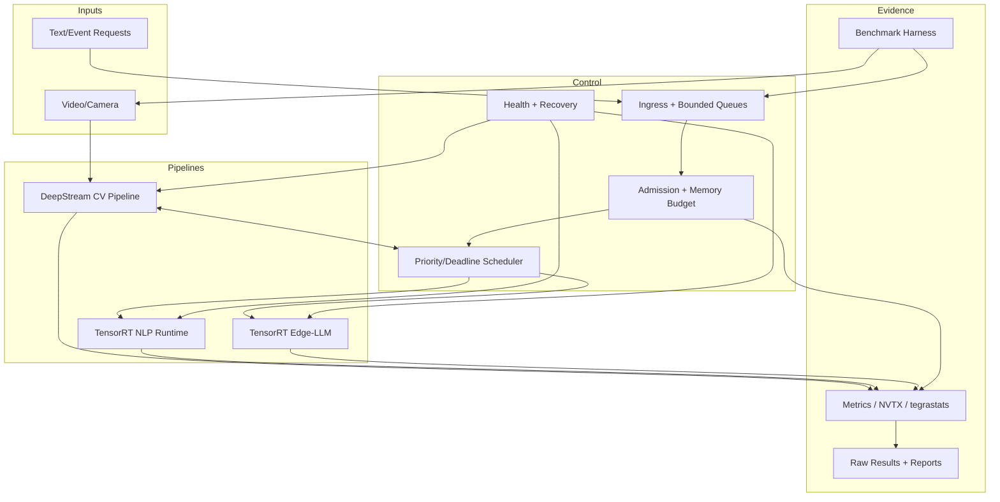

# 项目蓝图与验收标准

## 项目名称

**Orin NX Heterogeneous Inference Supervisor**

在 Jetson Orin NX 16GB 上运行实时 CV、突发 NLP/Embedding 和后台 LLM/VLM，通过统一准入、优先级、内存预算、背压和观测保障关键 SLA。

## 为什么这个项目比单一 LLM Demo 更有价值

它同时证明：

- 模型导出与 TensorRT 部署；
- CUDA/Plugin 和 profiling；
- DeepStream 视频工程；
- LLM/VLM 的 KV cache、量化和生成指标；
- C++/系统设计、队列、资源生命周期；
- 多模型并发、Serving、性能和稳定性；
- 边缘设备特有的内存、功耗、温度和降级。

这些证据更贴合“CV/语言/LLM 等模型并存”的真实目标。

## 固定参考负载

### Workload A：实时 CV

- 输入：摄像头或固定编码视频；
- 模型：小型 detector/segmenter，必须可在 TensorRT/DeepStream 复现；
- 优先级：最高；
- SLO：按目标 FPS 定义 frame deadline；
- 结果：检测/分割 + timestamp + dropped/stale reason。

### Workload B：NLP/Embedding

- 输入：长度分布固定的文本请求；
- 模型：小型 encoder/embedding/reranker ONNX；
- 优先级：中；
- SLO：p95 latency 和最低 goodput；
- 可调：batch size、queue delay、sequence bucket。

### Workload C：LLM 或 VLM

- 输入：固定 prompt 数据集；VLM 使用抽样关键帧；
- 模型：执行时 TensorRT Edge-LLM 明确支持、可在 16GB 留足余量的模型；
- 优先级：低/后台；
- SLO：TTFT、TPOT、最大 context/output 和最低 goodput；
- 可降级：并发、max tokens、context、VLM frame rate/分辨率。

模型具体名称由执行时的支持矩阵和 license 决定，必须固定 revision/hash。

## 目标架构



## 未来实现目录

第一个实现里程碑启动时再添加：

```text
configs/
  models/                 # engine/model manifests
  scenarios/              # arrival rates, SLA, duration, power mode
  scheduler/              # queues, priority, budgets
src/
  runtime/tensorrt/       # engine/context/stream/buffer pools
  runtime/edge_llm/       # Edge-LLM adapter
  pipeline/deepstream/    # CV pipeline and probes
  scheduler/              # admission, policy, cancellation
  telemetry/              # metrics, NVTX, system sampling
  service/                # API/IPC and health
tests/
  unit/                   # policy, budget, parsing
  integration/            # runtime/model fixtures
  fault/                  # process/source/model failures
benchmarks/
  workloads/              # fixed datasets/arrival traces
  run/                    # harness
  raw/                    # generated, not all committed
  reports/                # summarized reproducible reports
containers/
  Dockerfile              # pinned JetPack-compatible base
models/
  manifest/               # no large weights in Git
scripts/
  collect_versions.sh
  build_engines.sh
  run_scenario.sh
```

目录不代表必须一次实现全部模块；每个 milestone 只增加需要的部分。

## Milestone 0：环境证据

### 范围

完成 JetPack、CUDA、TensorRT、DeepStream、容器和 telemetry 的版本盘点与 smoke tests。

### 必须产物

- `version-manifest.yaml`；
- SDK Manager/first boot 记录；
- CUDA/TensorRT smoke logs；
- storage/power/cooling inventory；
- architecture (`x86_64`/`aarch64`) 说明。

### Gate

- exact versions 可复查；
- target 重启后 smoke tests 仍通过；
- 无失败 component 被忽略；
- 环境可复现说明经过一次重走。

## Milestone 1：单 CV TensorRT Baseline

### 范围

ONNX -> engine -> runner，建立 FP32/FP16 正确性和性能基线。

### 必须产物

- model manifest 和 model hash；
- export/build commands；
- fixed input/reference outputs；
- `trtexec` 原始日志；
- C++ runner；
- latency/throughput/memory/quality report。

### Gate

- engine 可重建；
- 数值/任务结果在定义阈值内；
- warm-up 和测量窗口明确；
- 至少三次独立测量；
- 输出 GPU compute 与 end-to-end 两组指标。

## Milestone 2：Telemetry 与 CUDA/Plugin

### 范围

加入 NVTX/采集，优化一个 profile 证明的前处理或 custom op。

### 必须产物

- Nsight Systems/Compute report；
- fused CUDA kernel + correctness test；
- TensorRT Plugin V3 + serialization test；
- before/after raw data；
- 并发 context 测试。

### Gate

- compute-sanitizer 无已知错误；
- 优化前后输入、power mode、版本一致；
- 报告端到端结果，不只报 kernel microbenchmark；
- 无收益也记录原因，不筛掉失败实验。

## Milestone 3：实时 CV Pipeline

### 范围

DeepStream/GStreamer 接入视频源、TensorRT engine 和 drop 策略。

### 必须产物

- pipeline diagram/config；
- capture-to-result timestamp；
- FPS/p99/drop/quality；
- 30 分钟稳定性结果；
- 直接 TensorRT 与 DeepStream 对照。

### Gate

- 队列有界；
- stale frames 不无限积压；
- source 断开有明确状态；
- 指定负载下满足声明的 CV frame budget。

## Milestone 4：第二模型与 LLM/VLM

### 范围

先加入 NLP TensorRT 模型，再加入 Edge-LLM 小模型，分别建立 isolated baseline。

### 必须产物

- NLP sequence/batch matrix；
- LLM precision/context/length matrix；
- TTFT/TPOT/tokens/s/KV/memory；
- FP16/INT8/INT4 中实际支持组合的质量对照；
- OOM 边界与安全预算。

### Gate

- 三个 workload 分别可稳定独立运行；
- LLM max context/tokens/concurrency 有硬限制；
- 量化有质量回归；
- 模型总工作集仍留有经实测定义的 system headroom。

## Milestone 5：多模型 Supervisor

### 范围

实现独立队列、priority、deadline、backpressure、admission control、memory reservations、cancel 和 metrics。

### 必须产物

- policy/state machine；
- unit tests（预算、队列、过期、拒绝）；
- fixed-load 与 saturation sweep；
- isolated/concurrent degradation；
- overload/rejection report；
- Triton 托管一个相同模型的对照。

### Gate

- 所有队列和主要内存池有上限；
- CV SLA 受保护；
- 过载先影响低优先级 goodput；
- 拒绝/降级原因可观测；
- 不通过进程 OOM 作为正常流量控制；
- 直接 runtime/Triton 选择有数据依据。

## Milestone 6：稳定性与交付

### 范围

热稳态、内存压力、故障、重启和 clean-room 复现。

### 必须产物

- 2 小时学习项目 soak；成熟后扩展 8/24 小时；
- temperature/frequency/power timeline；
- worker crash、source disconnect、model load failure 结果；
- clean boot/redeploy timing；
- reproducibility guide；
- known limitations 和未覆盖风险。

### Gate

- soak 无 OOM、无持续资源泄漏、无无界队列；
- 关键 workload 的 SLO/goodput 在热稳态仍满足；
- 故障影响范围和恢复时间可量化；
- 三次复现实验结果在预先定义的容差内；
- 每个图表能追踪到 raw file 和 manifest。

## Experiment Matrix

### 1. 隔离基线

| 场景 | 变量 | 输出 |
| --- | --- | --- |
| CV only | input/FPS/precision | p50/p95/p99, FPS, drop, memory, quality |
| NLP only | length/batch/arrival | throughput, p95/p99, actual batch |
| LLM only | ISL/OSL/precision/concurrency | TTFT, TPOT, tokens/s, KV, memory, quality |

### 2. 固定组合负载

- CV only；
- CV + NLP；
- CV + LLM；
- NLP + LLM；
- CV + NLP + LLM；
- 如加入 VLM，单列视觉 encoder 阶段。

每个组合与各自 isolated baseline 比较退化。

### 3. Saturation sweep

- 固定 CV 输入；
- 逐级增加 NLP request rate；
- 逐级增加 LLM concurrency/output tokens；
- 直到触发 SLO、queue 或 memory admission limit；
- 确认系统拒绝而不是崩溃。

### 4. Batch/instance/context sweep

- NLP batch size + queue delay；
- TensorRT context count；
- Triton instance count；
- LLM max active requests；
- 每次只改变一个维度，记录内存增量。

### 5. 量化矩阵

| 精度 | Build 成功 | Peak memory | Latency/throughput | Task quality | 支持状态 |
| --- | --- | --- | --- | --- | --- |
| FP32/FP16 |  |  |  |  | per model |
| INT8 |  |  |  |  | per model |
| INT4 |  |  |  |  | Edge-LLM model-specific |

不支持的组合标 `unsupported`，不能记成失败性能数据。

### 6. Cold/Warm

- cold boot -> service ready；
- model load/engine deserialize；
- first inference/first token；
- fully warmed steady state；
- repeated reload，检查资源释放。

### 7. Memory pressure

- 模型逐个加载；
- 增加 contexts/KV；
- 逼近 admission limit；
- 验证拒绝和 headroom；
- 不故意让 OS 不可恢复地 OOM 作为常规测试手段。

### 8. Thermal soak

- 固定 ambient/cooling/power mode；
- 至少 2 小时持续组合负载；
- 记录频率、温度、功耗、SLO、内存；
- 比较开始、中段、热稳态。

### 9. Fault injection

- kill worker；
- 断开/恢复视频源；
- corrupt/missing model manifest；
- backend/model load failure；
- API timeout/cancel；
- 日志目录空间告警模拟；
- 网络 client 断开。

### 10. Repeatability

- 相同 manifest/scenario 至少三次；
- 每次从声明的 clean/warm state 开始；
- 报 median 与 spread；
- 超出容差必须解释温度、频率、后台进程或输入差异。

## Acceptance 指标模板

数字在第一次 isolated baseline 后填写，不能提前编造：

```yaml
cv:
  target_fps: <measured-business-target>
  p99_deadline_ms: <frame-budget>
  max_drop_rate: <target>
  min_quality: <metric-threshold>
nlp:
  request_distribution: <dataset-revision>
  p95_ms: <target>
  min_goodput_rps: <target>
llm:
  isl_osl_distribution: <dataset-revision>
  p95_ttft_ms: <target>
  p95_tpot_ms: <target>
  min_goodput_tokens_s: <target>
  max_active_requests: <budget>
system:
  power_mode: <fixed-mode>
  minimum_memory_headroom_mb: <measured-safe-value>
  soak_duration_s: <duration>
  max_recovery_time_s: <target>
repeatability:
  runs: 3
  allowed_variation_percent: <target>
```

## 性能结论格式

每项优化都写：

1. 问题/SLO；
2. 假设；
3. 环境 manifest；
4. baseline 命令和原始结果；
5. profile 证据；
6. 只改变的变量；
7. correctness/quality；
8. latency/throughput/goodput/memory/power；
9. isolated 与 concurrent；
10. 失败条件和适用边界。

不写“性能显著提升”，写“在指定模型、输入、版本、功耗模式和负载下，指标从 X 变为 Y；p99/质量/功耗同时为 Z”。

## 什么情况下才能称为可上线

学习项目达到 Milestone 6，仍只代表“生产候选参考实现”。真正上线还需要根据业务补：

- 威胁模型、认证、授权、secret、网络加密；
- model/license/data compliance；
- systemd/容器编排、日志轮转、监控告警；
- OTA/rollback、版本迁移和 engine rebuild；
- 长周期 24/7 soak、硬件批次和环境温度；
- watchdog、断电恢复、文件系统一致性；
- 真实业务流量回放、容量和灾难恢复；
- carrier board/摄像头/电源/EMC 等产品验证。

因此本项目不把“Demo 成功”包装成“生产级已完成”。它的价值是提供可审计的工程证据和一条到生产的清晰路径。

## 最终交付清单

- 架构与设计决策；
- 环境/模型/场景 manifest；
- C++ runtime、CUDA kernel、Plugin、scheduler；
- DeepStream 与 Edge-LLM adapters；
- 自动化 benchmark 与 fault tests；
- raw results、trace、analysis；
- isolated/concurrent/thermal/quality 对照；
- reproducibility、operations 和 known limitations；
- 一份能被面试官逐项追问的技术报告。

